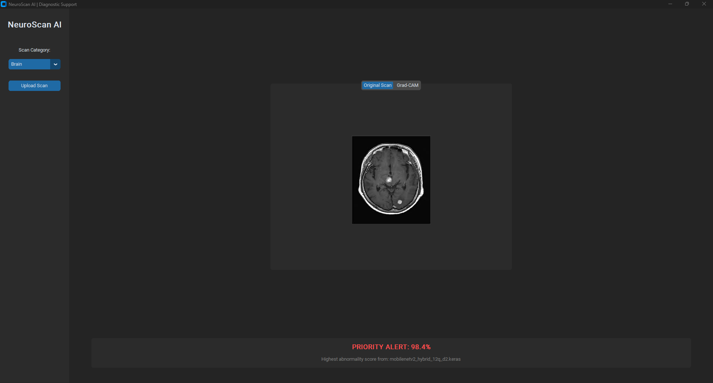
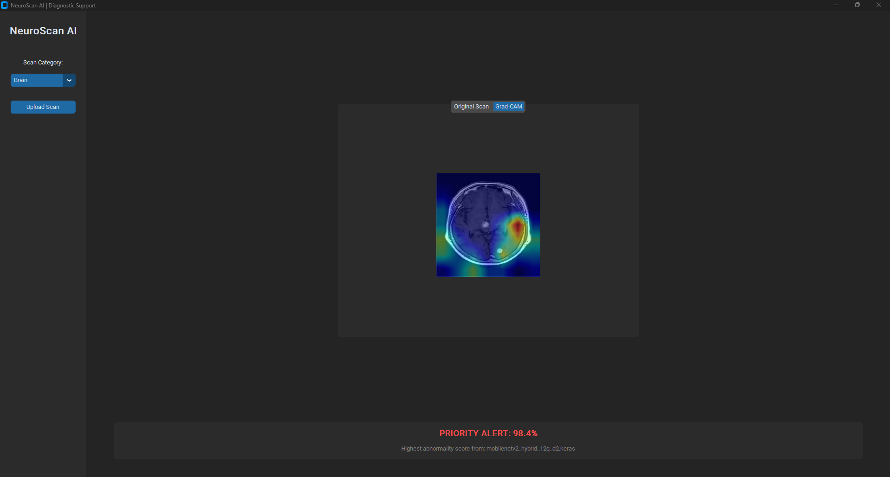
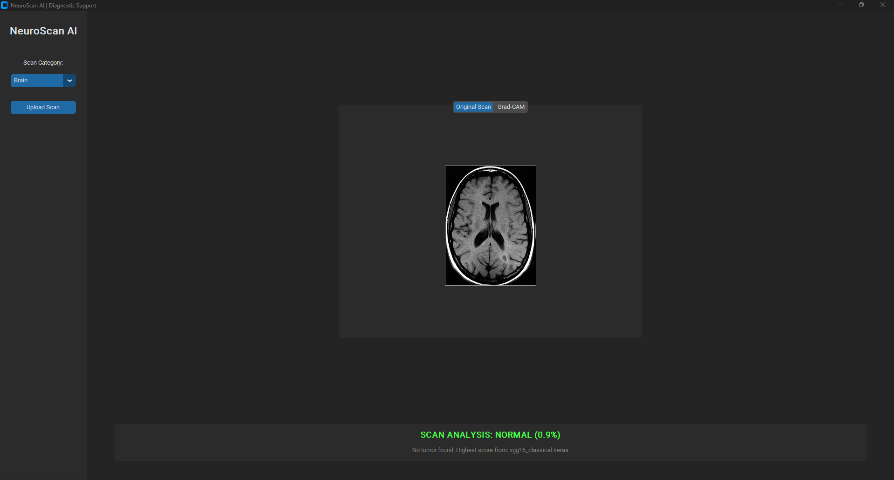

# NeuroScan AI – Medical Image Analysis with Hybrid Quantum Models

NeuroScan AI is a medical image analysis software that combines **classical deep learning** and **hybrid quantum-classical models** to assist in detecting abnormalities in medical scans.

The system is designed as a **diagnostic support tool**, not a clinical decision system.

---
IMPORTANT DISCLAIMER: Before usage please download the pretrained models, without them the software does not work! Download URLs are provided in the relevant models subfolders!
---

## Features

* **Multi-model ensemble**

  * Supports multiple CNN architectures:

    * ResNet50V2
    * VGG16 / VGG19
    * DenseNet121 / DenseNet201
    * EfficientNetB0
    * MobileNetV2
    * InceptionV3
    * Xception

* **Hybrid Quantum Models**

  * Integrates **PennyLane-based quantum layers**
  * Uses parameterized quantum circuits (PQC)
  * Demonstrates real-world hybrid AI limitations and behavior

* **Ensemble Decision Making**

  * Aggregates predictions across models
  * Uses a **max-confidence strategy** (medical safety oriented)

* **Explainability with Grad-CAM**

  * Visualizes regions influencing model decisions
  * Helps interpret model behavior

* **Graphical User Interface (GUI)**

  * Built with CustomTkinter
  * Tab-based visualization:

    * Original Scan
    * Grad-CAM Explanation

---

## Current Supported Modality

### Brain Tumor Detection (MRI)

* Binary classification:

  * Tumor (abnormal)
  * No tumor (normal)
* Trained on balanced dataset (~5.5k / 5.5k)

---

## ⚠️ Important Disclaimer

This software is:

* ❌ **NOT a medical device**
* ❌ **NOT for clinical diagnosis**
* ✔ Designed for:

  * Research
  * Education
  * Experimental AI evaluation

---

## Model Behavior

* Classical CNNs generally outperform hybrid models
* Hybrid QNNs demonstrate:

  * Limited feature extraction capacity
  * Sensitivity to input representation
* This aligns with current research limitations in **quantum machine learning**

---
## System Architecture

The NeuroScan AI system follows a **modular hybrid AI pipeline**, combining classical deep learning with quantum-enhanced components and explainability.

---

### High-Level Architecture

```text
                ┌──────────────────────────┐
                │   Medical Image Input    │
                │   (MRI / CT / etc.)     │
                └────────────┬─────────────┘
                             │
                             ▼
                ┌──────────────────────────┐
                │   Preprocessing Layer    │
                │ - Resize (224×224)      │
                │ - Normalization         │
                │ - Model-specific prep   │
                └────────────┬─────────────┘
                             │
         ┌───────────────────┴───────────────────┐
         │                                       │
         ▼                                       ▼
┌──────────────────────┐               ┌──────────────────────┐
│ Classical CNN Models │               │ Hybrid CNN + QNN     │
│                      │               │                      │
│ ResNet / VGG / etc.  │               │ CNN Feature Extractor│
│                      │               │        │             │
│ Fully Connected Head │               │        ▼             │
│        │             │               │  Quantum Layer (PQC) │
│        ▼             │               │        │             │
│ Prediction (Score)   │               │        ▼             │
└─────────┬────────────┘               │ Prediction (Score)   │
          │                            └─────────┬────────────┘
          └──────────────┬───────────────────────┘
                         ▼
              ┌──────────────────────────┐
              │ Ensemble Aggregation     │
              │ (Max Confidence Rule)    │
              └────────────┬─────────────┘
                           ▼
              ┌──────────────────────────┐
              │ Final Prediction Output  │
              │ Tumor / No Tumor         │
              └────────────┬─────────────┘
                           ▼
              ┌──────────────────────────┐
              │ Explainability Module    │
              │ (Grad-CAM)               │
              └────────────┬─────────────┘
                           ▼
              ┌──────────────────────────┐
              │ GUI Visualization        │
              │ - Original Image         │
              │ - Grad-CAM Heatmap       │
              └──────────────────────────┘
```

---

### Hybrid Quantum Layer (QNN)

The hybrid models integrate a **parameterized quantum circuit (PQC)**:

```text
Input Features → Angle Embedding → Entangling Layers → Measurement
```

* Implemented using **PennyLane**
* Uses:

  * `AngleEmbedding`
  * `StronglyEntanglingLayers`
* Outputs expectation values (Pauli-Z measurements)

---

### Design Philosophy

The system is designed based on:

* **Modularity** → Separate concerns (models, UI, explainability)
* **Comparability** → Same pipeline for all models
* **Extensibility** → Easy addition of new cancer types
* **Explainability-first** → Grad-CAM integration

---

### Key Insight

The architecture allows direct comparison between:

```text
Classical Deep Learning  vs  Hybrid Quantum Models
```

under identical conditions, enabling meaningful benchmarking.

---

### Future Extensions (Architecture Level)

* Multi-modal fusion (MRI + CT)
* Advanced ensemble strategies (weighted voting)
* Real-time clinical integration
* Improved quantum feature encoding


---

## Project Structure

```text
Code/
├── app.py              # Entry point
├── config.py           # Global configuration
├── quantum_layer.py    # Hybrid quantum layer (PennyLane)
├── model_manager.py    # Model loading + prediction
├── gradcam.py          # Explainability module
└── ui.py               # GUI
```

---

## Installation

### 1. Clone repository

```bash
git clone https://github.com/mousavi-hn/Cancer-Detection-Software.git
cd Cancer-Detection-Software/Code
```

### 2. Install dependencies

```bash
pip install tensorflow customtkinter pillow opencv-python numpy pennylane
```

---

##  Usage

Run the application:

```bash
python app.py
```

Steps:

1. Select scan category (currently: Brain)
2. Upload MRI image
3. View results:

   * Classification output
   * Grad-CAM visualization

---



---

## Output Interpretation

* **Score ≥ 0.5** → potential abnormality
* **Score < 0.5** → likely normal

Grad-CAM highlights regions that influenced the prediction.

---

## Future Work

The system is being extended to support:

* Lung Cancer (CT scans)
* Breast Cancer (Mammography)
* Skin Cancer (Dermoscopy)

Additional improvements planned:

* Improved dataset diversity (clinical sources)
* Advanced ensemble strategies
* Better hybrid quantum architectures
* Integration with real hospital datasets (ongoing)

---

## Acknowledgment

Developed as part of research exploring:

* Deep Learning in Medical Imaging
* Quantum Machine Learning (QML)
* Hybrid AI systems

---

## Author

Hossein Mousavi
BSc Computer Science Engineering
Budapest University of Technology and Economics (BME)

---

## License

For academic and research use.
